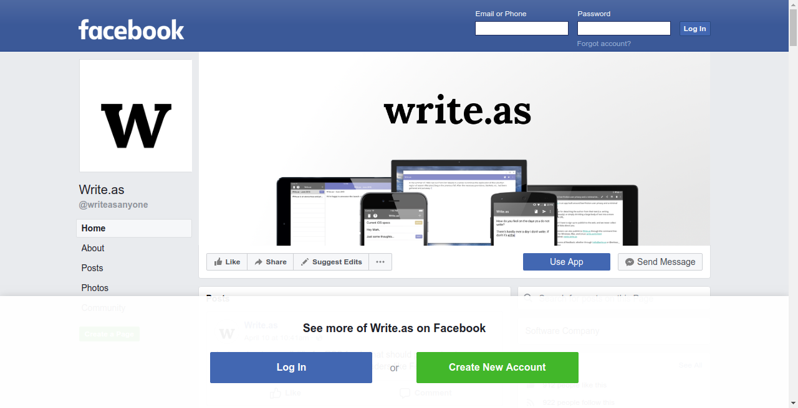

	
	

Make Facebook Browsable is a [Chrome extension](https://chrome.google.com/webstore/detail/deonhbbbllfoliccambkefchaikengaa) and [Firefox add-on](https://addons.mozilla.org/en-US/firefox/addon/make-facebook-browsable/) for people who don't use Facebook but still unfortunately come across Facebook links. It gets rid of login and signup prompts so you can get whatever information you need and then get the hell out of there.

### Preview

_Facebook: WTF? (before)_
<kbd></kbd>

_Well at least I can read this now (after)_
<kbd></kbd>

### Contributing

Want to improve something? Please do! Send a pull request or file an issue!

### License

MIT

### Related

Other extensions to make the internet less annoying:

* [Make Medium Readable Again](https://github.com/thebaer/MMRA)
